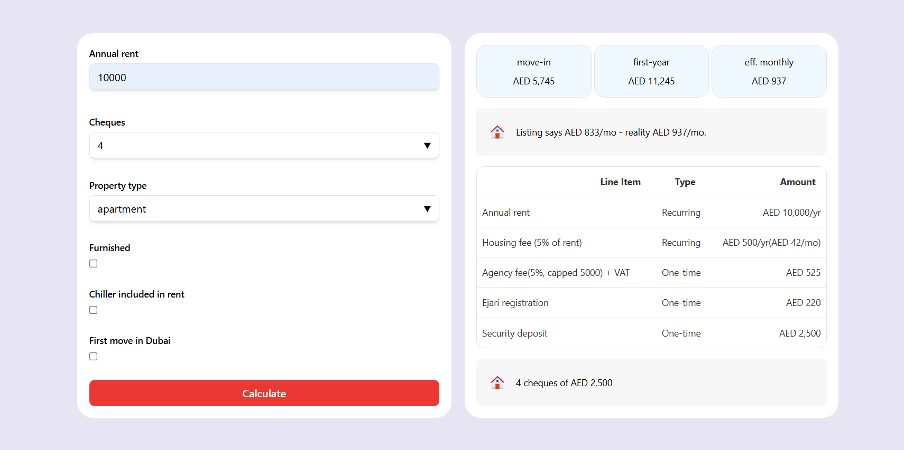

# Renting calculator

[Calculator for real renting cost evaluation](https://true-cost-of-renting.netlify.app/)



## What it computes

It takes into account the annual rent, the number of cheques, the type of property and other parameters and returns the cost of moving in, the real cost for the first year and for each month.

## Why listed rent isn't the cost

Fees sit on two independent axes. When you pay, and whether you get it back. The agency fee is paid upfront and is not refundable. The security deposit counts toward move-in but not toward first-year cost, because the tenant gets it back.

## Worked example

Annual Rent = 10000; Cheques count = 4; Property type = apartment;

move-in = (annual rent / cheque count) + (annual rent * agency fee rate + annual rent * agency fee rate * vat rate) + ejari registration + dewa deposit apartment + annual rent * deposit rate unfurnished = 
(10000 / 4) + (10000 * 0.05 + 10000 * 0.05 * 0.05) + 220 + 2000 + 10000 * 0.05 = 5745

first-year = annual rent + agency fee + ejari registration + housing fee = 
10000 + (10000 * 0.05 + 10000 * 0.05 * 0.05) + 220 + 10000 * 0.05 = 11245

eff. monthly = first-year / 12 = ~937

Same inputs, villa: move-in becomes 7745, up by exactly the DEWA difference. First-year and monthly don't change.

## Scope

Dubai only. Fee rules live in code, not config. No persistence.

1. No scraping
2. No live chiller-provider rates(one labeled estimate)

## Run

Stack: Next.js + TypeScript + Tailwind + Vitest

```
npm install

#How to run: 

npm run dev

#How to test: 

npm run check #(tests, lint, typecheck)
```

## Assumptions

| Constant                 | Value |
| ------------------------ | ----- |
| EJARI_REGISTRATION       | 220   |
| DEPOSIT_RATE_UNFURNISHED | 0.05  |
| DEPOSIT_RATE_FURNISHED   | 0.1   |
| DEWA_DEPOSIT_APARTMENT   | 2000  |
| DEWA_DEPOSIT_VILLA       | 4000  |
| AGENCY_FEE_RATE          | 0.05  |
| VAT_RATE                 | 0.05  |
| CHILLER_DEPOSIT_ESTIMATE | 2000  |
| HOUSING_FEE_RATE         | 0.05  |
| DEWA_ACTIVATION_FEE      | 130   |


